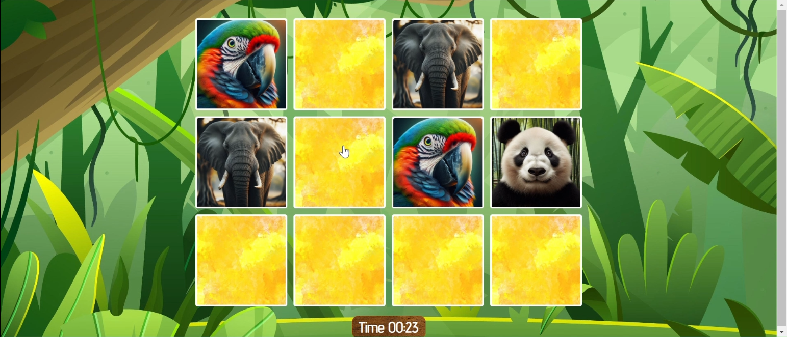

# Muistipeli

Klassinen muistipeli, jossa pelaaja kääntää kortteja ja yrittää löytää parit.

## Kuvaus
Peli on tehty Angularilla ja JavaScriptin kirjastoilla, kuten Anime.js, tuomaan animaatioita ja vuorovaikutteisuutta.  
Visuaalinen teema on viidakkomainen, ja kuvat on luotu Canvalla. Pelissä on ajastin ja animoidut korttien käännösliikkeet.

## Tekniikat
- HTML & CSS  
- JavaScript / jQuery  
- Angular  
- Anime.js  
- Canva (kuvat)

## Screenshots

